# 🗺️ Diagramas de Arquitectura: Navegación Modular

## 1️⃣ Flujo de Renderizado de Navegación

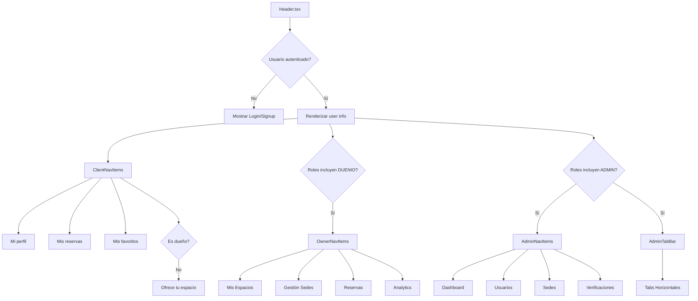

---

## 2️⃣ Jerarquía de Componentes

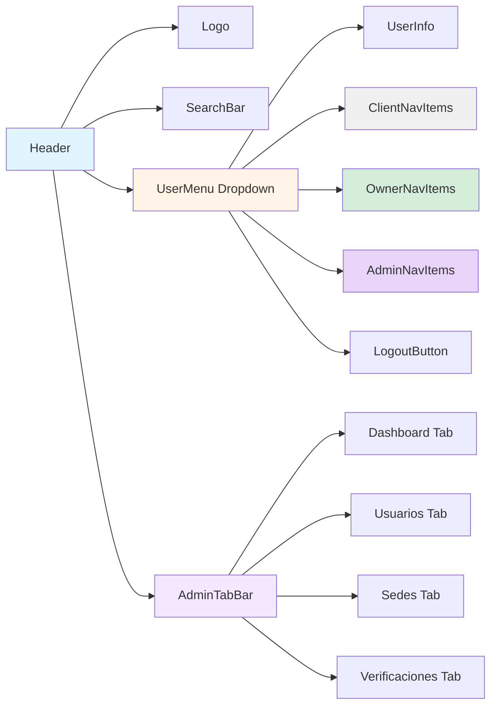

---

## 3️⃣ Modelo de Datos: Navegación por Rol

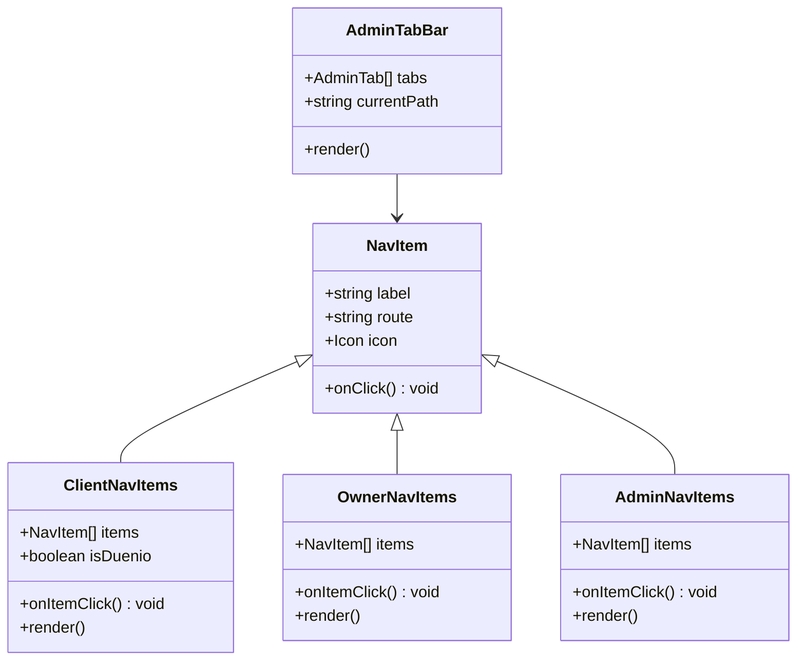

---

## 4️⃣ Estado de Renderizado por Rol

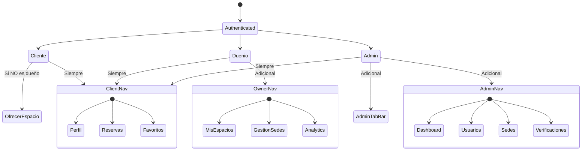

---

## 5️⃣ Flujo de Navegación Admin

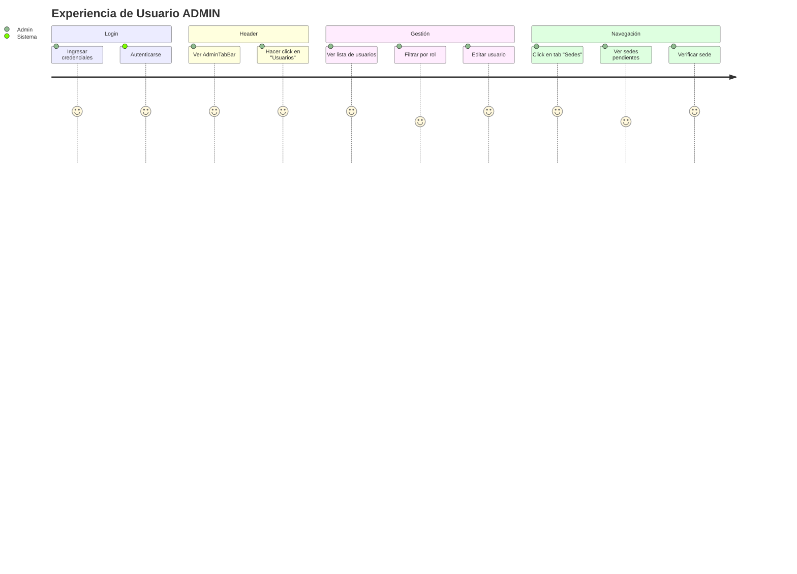

---

## 6️⃣ Arquitectura de Carpetas

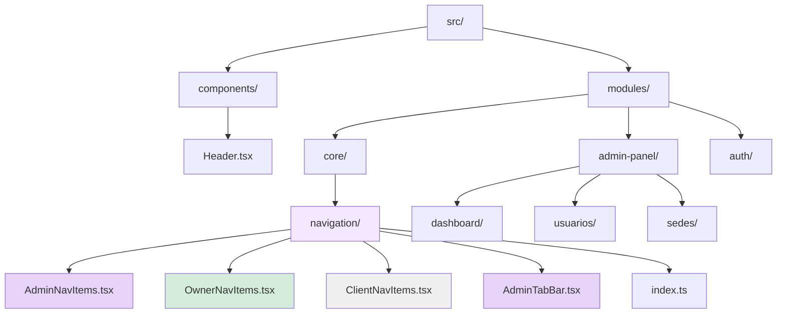

---

## 7️⃣ Relación Componente-Ruta

```mermaid
graph LR
    A[AdminNavItems] --> B[/admin/dashboard]
    A --> C[/admin/usuarios]
    A --> D[/admin/sedes]
    A --> E[/admin/verificaciones]
    
    F[OwnerNavItems] --> G[/owner/spaces]
    F --> H[/admin-spaces]
    F --> I[/owner/analytics]
    
    J[ClientNavItems] --> K[/profile]
    J --> L[/bookings]
    J --> M[/favoritos]
    J --> N[/host-space]
    
    O[AdminTabBar] --> B
    O --> C
    O --> D
    O --> E
    O --> P[/admin/reportes]
    O --> Q[/admin/analytics]
    
    style A fill:#e8d4f8
    style F fill:#d4edda
    style J fill:#f0f0f0
    style O fill:#f3e8ff
```

---

## 8️⃣ Decisiones de Renderizado Condicional

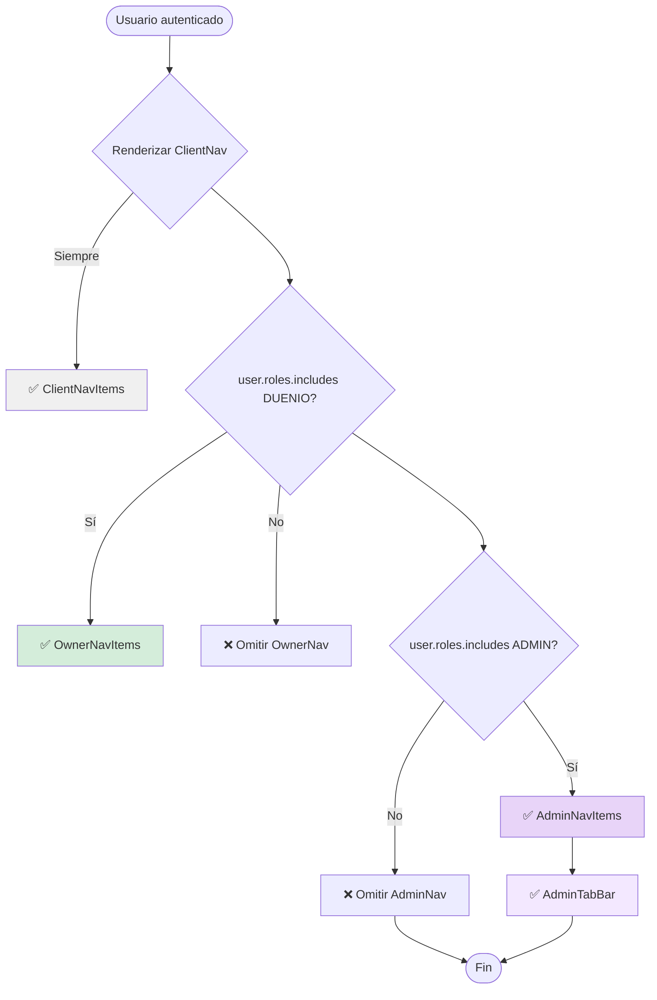

---

## 9️⃣ Secuencia de Click en Navegación

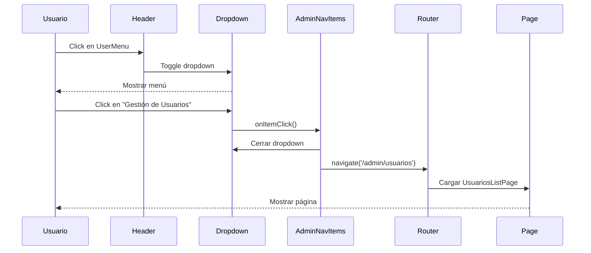

---

## 🔟 Matriz de Visibilidad de Navegación

| Componente | CLIENTE | DUEÑO | ADMIN | Notas |
|------------|---------|-------|-------|-------|
| **ClientNavItems** | ✅ | ✅ | ✅ | Siempre visible |
| Mi perfil | ✅ | ✅ | ✅ | - |
| Mis reservas | ✅ | ✅ | ✅ | - |
| Mis favoritos | ✅ | ✅ | ✅ | - |
| Ofrece tu espacio | ✅ | ❌ | ✅ | Si NO es dueño |
| **OwnerNavItems** | ❌ | ✅ | ❌ | Solo dueños |
| Mis Espacios | ❌ | ✅ | ❌ | - |
| Gestión Sedes | ❌ | ✅ | ❌ | - |
| Analytics | ❌ | ✅ | ❌ | - |
| **AdminNavItems** | ❌ | ❌ | ✅ | Solo admins |
| Dashboard | ❌ | ❌ | ✅ | - |
| Usuarios | ❌ | ❌ | ✅ | - |
| Verificaciones | ❌ | ❌ | ✅ | - |
| **AdminTabBar** | ❌ | ❌ | ✅ | Fuera dropdown |

---

## 📊 Estadísticas de Implementación

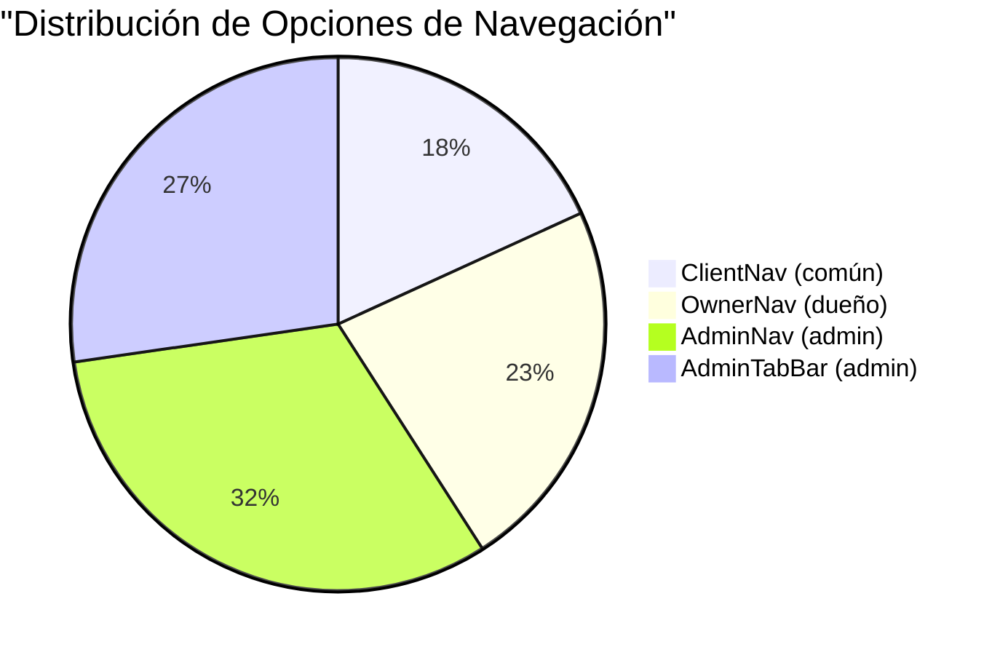

---

## 🎨 Esquema de Colores

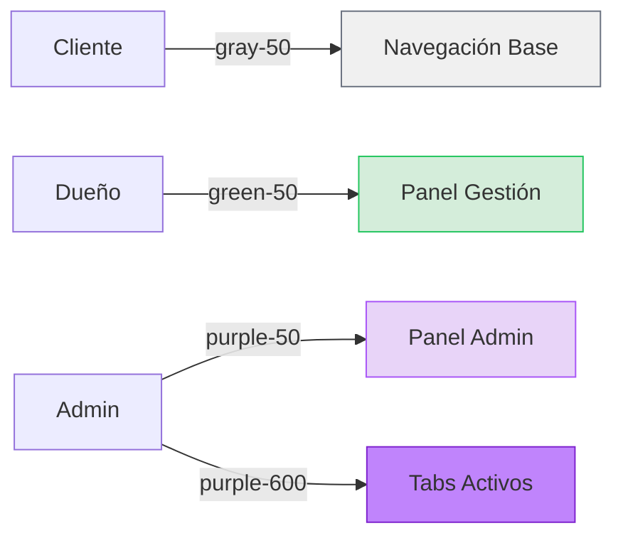

---

## 🔄 Ciclo de Vida del Componente

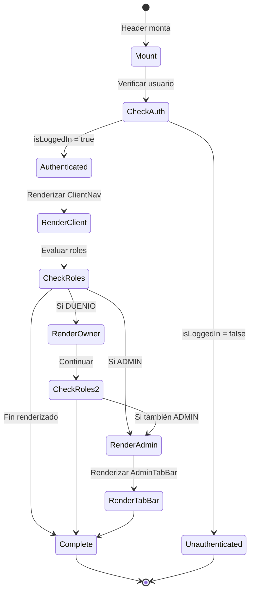

---

**Nota**: Estos diagramas se pueden visualizar correctamente en editores compatibles con Mermaid como VS Code (con extensión) o en GitHub/GitLab.
