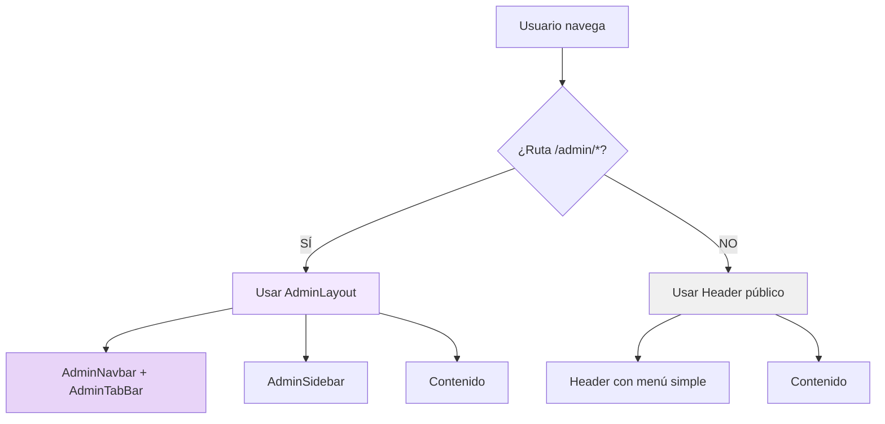

# 🔧 Solución: Un Solo Navbar por Contexto

## 🎯 Problema Identificado

**ANTES:** Teníamos 2 navbars superpuestos cuando el usuario admin estaba en el panel de administración:

```
┌─────────────────────────────────────┐
│ Header.tsx (Público)                │ ← Navbar 1
│  + AdminTabBar (dentro del Header)  │
├─────────────────────────────────────┤
│ AdminNavbar.tsx (Panel Admin)       │ ← Navbar 2
├─────────────────────────────────────┤
│ Contenido de la página              │
└─────────────────────────────────────┘
```

**Resultado:** Dos barras de navegación apiladas = mala UX

---

## ✅ Solución Implementada

**AHORA:** Un solo navbar según el contexto de navegación:

### 1. **Rutas Públicas** (/, /profile, /bookings, etc.)
```
┌─────────────────────────────────────┐
│ Header.tsx                          │ ← Solo Header público
├─────────────────────────────────────┤
│ Contenido de la página              │
└─────────────────────────────────────┘
```

### 2. **Rutas Admin** (/admin/*)
```
┌─────────────────────────────────────┐
│ AdminNavbar (Búsqueda + Usuario)    │ ← Navbar específico admin
├─────────────────────────────────────┤
│ AdminTabBar (Dashboard | Usuarios)  │ ← Tabs de navegación
├─────────────────────────────────────┤
│ AdminSidebar │ Contenido            │
│              │                      │
└─────────────────────────────────────┘
```

---

## 🔄 Cambios Implementados

### 1. **Header.tsx** (Navbar Público)

**Eliminado:**
- ❌ AdminTabBar del header público
- ❌ Componentes modulares (AdminNavItems, OwnerNavItems, ClientNavItems)
- ❌ Navegación compleja por roles

**Simplificado a:**
```tsx
// Navegación básica
- Mi perfil
- Mis reservas
- Mis favoritos

// Link rápido a panel según rol
- Panel de Administración (si ADMIN)
- Mis Espacios (si DUEÑO)

// Logout
```

**Código:**
```tsx
{!isAdminRoute && (
  <Header onLoginClick={...} onSignupClick={...} onLogout={...} />
)}
```

---

### 2. **AdminNavbar.tsx** (Navbar Admin)

**Ahora incluye:**
```tsx
<div>
  {/* Header con búsqueda y usuario */}
  <header>
    <Search />
    <Notifications />
    <UserInfo />
    <Logout />
  </header>

  {/* Tabs de navegación */}
  <AdminTabBar />
</div>
```

**Estructura:**
- Parte superior: Búsqueda + Notificaciones + Usuario + Logout
- Parte inferior: Tabs horizontales (Dashboard | Usuarios | Sedes | ...)

---

### 3. **AdminTabBar.tsx**

**Actualizado:**
- Removido el wrapper `max-w-7xl mx-auto` (ahora lo controla AdminNavbar)
- Cambiado a `px-6` para alinearse con AdminNavbar
- Solo maneja los tabs, no el container

---

### 4. **App.tsx**

**Lógica condicional:**
```tsx
const isAdminRoute = location.pathname.startsWith('/admin');

// Header público solo si NO es ruta admin
{!isAdminRoute && <Header ... />}

// Rutas admin usan AdminLayout
<Route 
  path="/admin/dashboard" 
  element={<AdminLayout><NewDashboardPage /></AdminLayout>} 
/>
```

**AdminLayout incluye:**
- AdminSidebar (izquierda)
- AdminNavbar (arriba con AdminTabBar)
- Contenido (main)

---

## 🎨 Arquitectura Visual

### Flujo de Navegación



---

## 📦 Componentes Finales

### Navegación Pública (Header.tsx)
```tsx
Header
├── Logo + Search
├── "Ofrece tu espacio" (si no es dueño)
├── User Menu Dropdown
│   ├── Mi perfil
│   ├── Mis reservas
│   ├── Mis favoritos
│   ├── Panel de Administración (si ADMIN)
│   ├── Mis Espacios (si DUEÑO)
│   └── Cerrar sesión
└── Mobile search bar
```

### Navegación Admin (AdminLayout)
```tsx
AdminLayout
├── AdminSidebar
│   ├── Dashboard
│   ├── Usuarios
│   ├── Sedes
│   └── ...
└── AdminNavbar
    ├── Header (búsqueda + usuario + logout)
    └── AdminTabBar
        ├── Dashboard
        ├── Usuarios
        ├── Sedes
        ├── Verificaciones
        ├── Reportes
        └── Analytics
```

---

## 🚀 Beneficios

### 1. **Separación Clara**
- Header público para sitio web general
- AdminNavbar para panel de administración
- No hay superposición

### 2. **Mejor UX**
- Un solo navbar visible a la vez
- Navegación contextual según la ruta
- Menos confusión para el usuario

### 3. **Mantenibilidad**
- Header público más simple
- AdminNavbar específico para admin
- Cada uno cumple su función

### 4. **Performance**
- No renderiza componentes innecesarios
- Header público no carga lógica de admin
- AdminLayout solo se carga en rutas /admin

---

## 🔑 Rutas y Contextos

### Contexto Público (Header.tsx)
```
/                    → HomePage
/profile             → ProfilePage
/bookings            → MyBookingsPage
/favoritos           → FavoritesPage
/venues/:id          → VenueDetailPage
/field/:id           → FieldDetailPage
/host-space          → HostSpacePage
/admin-spaces        → AdminSpacesPage (dueños)
```

### Contexto Admin (AdminLayout)
```
/admin/dashboard         → NewDashboardPage
/admin/usuarios          → UsuariosListPage
/admin/sedes             → SedesListPage
/admin/verificaciones    → (próximamente)
/admin/reportes          → (próximamente)
/admin/analytics         → (próximamente)
```

---

## 🛠️ Cómo Funciona

### 1. Usuario en Página Pública
```tsx
// App.tsx detecta que NO es /admin/*
isAdminRoute = false

// Renderiza Header público
<Header ... />

// Renderiza página sin AdminLayout
<ProfilePage />
```

### 2. Usuario Hace Click en "Panel de Administración"
```tsx
// Navega a /admin/dashboard
navigate('/admin/dashboard')

// App.tsx detecta /admin/*
isAdminRoute = true

// NO renderiza Header público
{!isAdminRoute && <Header />} // ← No se muestra

// Renderiza con AdminLayout
<AdminLayout>
  <NewDashboardPage />
</AdminLayout>
```

### 3. AdminLayout Renderiza
```tsx
<div className="flex h-screen">
  <AdminSidebar />
  
  <div className="flex-1">
    <AdminNavbar /> {/* ← Incluye AdminTabBar */}
    
    <main>
      {children} {/* ← NewDashboardPage */}
    </main>
  </div>
</div>
```

---

## 📊 Comparación Antes/Después

| Aspecto | ANTES | DESPUÉS |
|---------|-------|---------|
| **Navbars en /admin** | 2 (Header + AdminNavbar) | 1 (AdminNavbar) |
| **Navbars en /profile** | 1 (Header) | 1 (Header) |
| **AdminTabBar ubicación** | Dentro de Header público | Dentro de AdminNavbar |
| **Complejidad Header** | Alta (lógica de 3 roles) | Baja (navegación simple) |
| **Separación de concerns** | ❌ Mezclado | ✅ Separado |
| **UX** | ❌ Confusa | ✅ Clara |

---

## 🎯 Resultado Final

### Usuario CLIENTE
- Ve Header público simple
- Navegación: Perfil, Reservas, Favoritos
- No ve opciones de admin/dueño

### Usuario DUEÑO
- Ve Header público
- Navegación: Perfil, Reservas, Favoritos, Mis Espacios
- Al ir a "Mis Espacios" → ve su panel

### Usuario ADMIN
- Ve Header público en páginas generales
- Al ir a "Panel de Administración" (/admin/dashboard)
  - Header público desaparece
  - Aparece AdminLayout completo (Sidebar + Navbar + Tabs)
  - Navegación optimizada para gestión

---

## 🔮 Próximos Pasos

1. **Agregar OwnerLayout** similar a AdminLayout para dueños
2. **Implementar breadcrumbs** en AdminLayout
3. **Agregar notificaciones funcionales** en AdminNavbar
4. **Testing** de la navegación contextual
5. **Documentar** navegación para nuevos desarrolladores

---

## 📝 Archivos Modificados

```
✅ src/components/Header.tsx
   - Simplificado navegación
   - Eliminado AdminTabBar
   - Solo navegación básica

✅ src/modules/admin-panel/layout/AdminNavbar.tsx
   - Agregado AdminTabBar
   - Estructura de 2 niveles

✅ src/modules/core/navigation/AdminTabBar.tsx
   - Removido wrapper max-w-7xl
   - Ajustado padding

✅ src/App.tsx
   - Lógica condicional isAdminRoute
   - Rutas /admin usan AdminLayout
   - Header solo en rutas públicas
```

---

**Estado**: ✅ **COMPLETADO**  
**Problema**: Resuelto - Solo 1 navbar por contexto  
**UX**: Mejorada significativamente  
**Arquitectura**: Limpia y escalable
