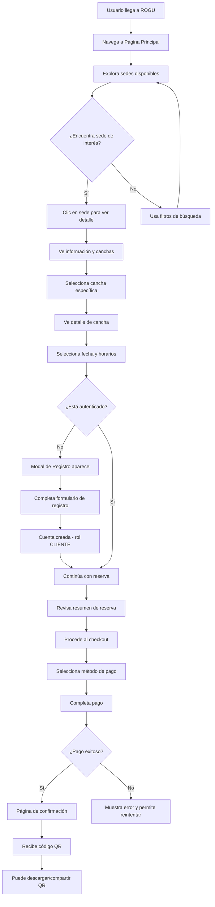
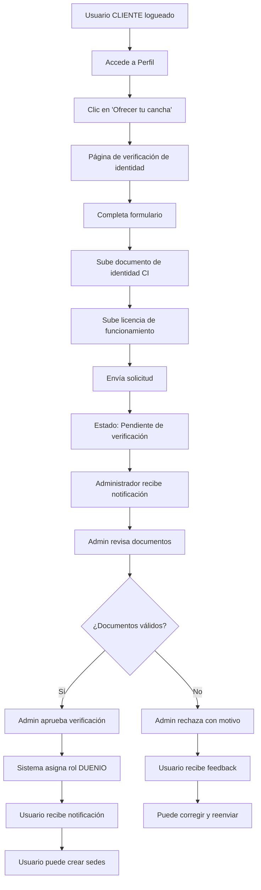
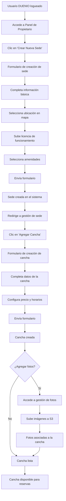
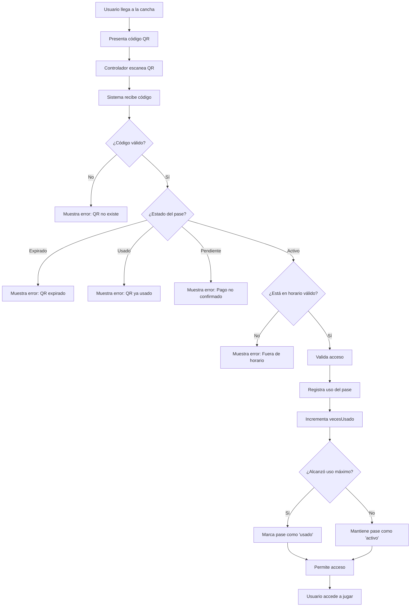
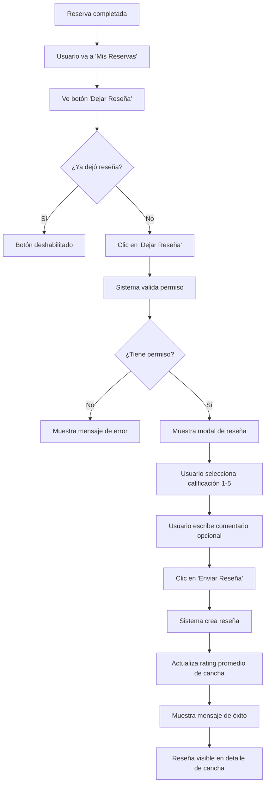

# Descripción Funcional - Sistema ROGU

## 1. Descripción General del Sistema

### 1.1 Propósito del Sistema

**ROGU** es una plataforma web integral diseñada para facilitar la gestión, búsqueda y reserva de espacios deportivos. El sistema conecta a usuarios finales con propietarios de sedes deportivas, proporcionando una experiencia completa que abarca desde la búsqueda de canchas hasta la confirmación y pago de reservas.

El sistema está desarrollado como parte de un proyecto académico del **Taller de Ingeniería de Software** del 6to semestre, implementando las mejores prácticas de desarrollo moderno y arquitectura de software empresarial.

### 1.2 Objetivos del Sistema

1. **Facilitar la búsqueda**: Permitir a los usuarios encontrar espacios deportivos según ubicación, deporte, precio y disponibilidad
2. **Automatizar reservas**: Gestionar reservas en tiempo real con validación de horarios y confirmación automática
3. **Integrar pagos**: Procesar pagos de forma segura mediante múltiples métodos (MercadoPago, PSE, transferencias)
4. **Optimizar gestión**: Proveer herramientas de administración para propietarios de sedes deportivas
5. **Generar analíticas**: Ofrecer dashboards con métricas e insights para toma de decisiones
6. **Gestionar reputación**: Implementar sistema de reseñas y calificaciones verificadas

### 1.3 Alcance del Sistema

#### Funcionalidades Incluidas:
- Sistema de autenticación y autorización multi-rol
- Búsqueda avanzada con filtros y mapas interactivos
- Gestión completa de reservas (crear, editar, cancelar)
- Sistema de pagos integrado con múltiples métodos
- Generación de códigos QR para acceso a canchas
- Sistema de reseñas y calificaciones
- Dashboard de analytics para propietarios
- Panel administrativo para gestión de usuarios, sedes y canchas
- Gestión de favoritos
- Sistema de verificación de identidad para propietarios

#### Funcionalidades No Incluidas (Roadmap):
- Notificaciones push en tiempo real
- Chat en vivo entre usuarios y propietarios
- Sistema de membresías o suscripciones
- Aplicación móvil nativa

---

## 2. Roles de Usuario

El sistema implementa un **sistema multi-rol**, donde un usuario puede tener múltiples roles simultáneamente:

### 2.1 Cliente (CLIENTE)

**Descripción**: Usuario final que busca y reserva espacios deportivos.

**Permisos y Funcionalidades**:
- ✅ Buscar sedes y canchas deportivas
- ✅ Ver detalles de sedes, canchas y horarios
- ✅ Crear, editar y cancelar reservas
- ✅ Realizar pagos de reservas
- ✅ Generar y descargar códigos QR de acceso
- ✅ Dejar reseñas y calificaciones
- ✅ Gestionar favoritos
- ✅ Ver historial de reservas
- ✅ Actualizar perfil personal
- ❌ Acceder a paneles de administración
- ❌ Crear sedes o canchas

### 2.2 Dueño/Propietario (DUENIO)

**Descripción**: Propietario de sedes deportivas que ofrece espacios para renta.

**Permisos y Funcionalidades**:
- ✅ Todas las funcionalidades de CLIENTE
- ✅ Crear y gestionar sedes deportivas
- ✅ Crear y gestionar canchas dentro de sus sedes
- ✅ Configurar horarios y precios
- ✅ Gestionar fotos de sedes y canchas
- ✅ Ver dashboard de analytics con KPIs
- ✅ Ver y responder reseñas
- ✅ Gestionar reservas de sus canchas
- ✅ Exportar reportes (CSV)
- ✅ Verificar identidad mediante documentos
- ❌ Acceder al panel de administración global
- ❌ Modificar datos de otros propietarios

**Proceso de Verificación**:
1. Usuario CLIENTE accede a "Ofrecer tu cancha"
2. Completa verificación de identidad (CI, licencia de funcionamiento)
3. Administrador revisa y aprueba documentos
4. Sistema asigna rol DUENIO al usuario

### 2.3 Controlador (CONTROLADOR)

**Descripción**: Personal encargado de validar el acceso físico a las canchas mediante códigos QR.

**Permisos y Funcionalidades**:
- ✅ Escanear códigos QR de reservas
- ✅ Validar acceso a canchas
- ✅ Registrar uso de pases de acceso
- ✅ Ver información básica de reservas
- ❌ Crear o modificar reservas
- ❌ Acceder a información financiera

### 2.4 Administrador (ADMIN)

**Descripción**: Administrador con acceso completo al sistema para gestión y supervisión.

**Permisos y Funcionalidades**:
- ✅ Acceso total al panel administrativo
- ✅ Gestión de usuarios (CRUD completo)
- ✅ Gestión de sedes y canchas (todas)
- ✅ Revisar y aprobar verificaciones de propietarios
- ✅ Acceder a todas las métricas y reportes
- ✅ Modificar cualquier dato del sistema
- ✅ Gestionar roles de usuarios
- ❌ No puede realizar reservas desde panel admin (debe usar interfaz de cliente)

---

## 3. Módulos Funcionales

### 3.1 Módulo de Autenticación (auth)

**Propósito**: Gestionar el acceso seguro al sistema y la identidad de usuarios.

#### Funcionalidades Principales:

##### 3.1.1 Registro de Usuarios
- **Entrada**: Formulario con datos personales (nombres, apellidos, teléfono, fecha de nacimiento, género, email, contraseña)
- **Proceso**:
  1. Validación de datos en frontend
  2. Creación de registro de Persona
  3. Creación de Usuario vinculado a Persona
  4. Asignación automática del rol CLIENTE
  5. Generación de token JWT
- **Salida**: Usuario autenticado con sesión activa

##### 3.1.2 Inicio de Sesión
- **Entrada**: Email y contraseña
- **Proceso**:
  1. Validación de credenciales
  2. Generación de token JWT
  3. Almacenamiento de token en localStorage
  4. Redirección según rol principal (ADMIN → panel admin, DUENIO → panel owner, CLIENTE → continúa en página actual)
- **Salida**: Sesión activa con permisos según roles

##### 3.1.3 Gestión de Sesión
- **Persistencia**: Token JWT almacenado en localStorage
- **Validación**: Verificación del token en cada solicitud protegida
- **Expiración**: Cierre automático de sesión al expirar token
- **Cierre de Sesión**: Limpieza de localStorage y redirección

#### Seguridad:
- Autenticación basada en JWT (JSON Web Tokens)
- Contraseñas hasheadas en backend
- Validación de campos en frontend y backend
- Protección de rutas mediante ProtectedRoute component

---

### 3.2 Módulo de Búsqueda (search)

**Propósito**: Permitir a los usuarios encontrar sedes y canchas deportivas según sus necesidades.

#### Funcionalidades Principales:

##### 3.2.1 Búsqueda de Sedes
- **Filtros Disponibles**:
  - 📍 **Ubicación**: Ciudad, zona, dirección
  - ⚽ **Tipo de deporte**: Fútbol, básquet, vóley, tenis, etc.
  - 💰 **Rango de precio**: Precio por hora
  - 📅 **Disponibilidad**: Fecha y hora específica
  - ⭐ **Calificación**: Rating mínimo

##### 3.2.2 Visualización de Resultados
- **Vista de Lista**: Cards con información resumida de cada sede
  - Nombre y ubicación
  - Foto principal
  - Rating promedio
  - Rango de precios
  - Deportes disponibles
  - Botón de favoritos
  
- **Vista de Mapa**: Mapa interactivo con ubicación geográfica
  - Marcadores de sedes
  - Información básica en popup
  - Navegación integrada

##### 3.2.3 Ordenamiento
- Más relevantes
- Precio: menor a mayor
- Precio: mayor a menor
- Mejor calificados
- Más cercanos (si se habilita geolocalización)

#### Tecnologías:
- Leaflet para mapas interactivos
- OpenStreetMap para datos cartográficos
- Filtros reactivos con estado local

---

### 3.3 Módulo de Sedes (venues)

**Propósito**: Gestionar las sedes deportivas (espacios físicos que contienen canchas).

#### Funcionalidades Principales:

##### 3.3.1 Visualización de Detalle de Sede
- **Información Mostrada**:
  - Nombre y descripción
  - Dirección completa y mapa de ubicación
  - Horarios de atención
  - Teléfono de contacto
  - Amenidades (estacionamiento, vestuarios, cafetería, etc.)
  - Galería de fotos
  - Lista de canchas disponibles en la sede
  - Reseñas y calificaciones

##### 3.3.2 Creación de Sede (Solo DUENIO)
- **Datos Requeridos**:
  - Nombre de la sede
  - Descripción
  - Dirección completa
  - Coordenadas GPS (selección en mapa)
  - Teléfono
  - Horario de apertura y cierre
  - Amenidades disponibles
  - Licencia de funcionamiento (archivo PDF/imagen)
- **Proceso**:
  1. Usuario con rol DUENIO accede a formulario
  2. Completa información de sede
  3. Sube licencia de funcionamiento
  4. Sistema crea sede asociada al propietario
  5. Sede queda en estado "pendiente de verificación"
  6. Administrador aprueba la sede

##### 3.3.3 Edición de Sede (Solo propietario o ADMIN)
- Modificar toda la información de la sede
- Actualizar galería de fotos
- Cambiar horarios de atención
- Editar amenidades

##### 3.3.4 Gestión de Fotos de Sede
- **Subir Fotos**: Integración con AWS S3 para almacenamiento
- **Eliminar Fotos**: Propietario puede gestionar su galería
- **Foto Principal**: Designar foto de portada
- **Límite**: Hasta 10 fotos por sede

##### 3.3.5 Eliminación de Sede
- Solo propietario o ADMIN
- Validación de canchas sin reservas activas
- Eliminación en cascada de fotos y relaciones

---

### 3.4 Módulo de Canchas (fields)

**Propósito**: Gestionar las canchas deportivas dentro de las sedes.

#### Funcionalidades Principales:

##### 3.4.1 Visualización de Detalle de Cancha
- **Información Mostrada**:
  - Nombre y tipo de deporte
  - Descripción y características
  - Dimensiones (largo x ancho)
  - Tipo de superficie (césped, sintético, parquet, etc.)
  - Techo (techado/al aire libre)
  - Capacidad de jugadores
  - Precio por hora
  - Horarios disponibles
  - Galería de fotos
  - Calendario de disponibilidad
  - Reseñas y calificaciones

##### 3.4.2 Creación de Cancha (Solo DUENIO)
- **Datos Requeridos**:
  - Sede a la que pertenece
  - Nombre de la cancha
  - Tipo de deporte
  - Descripción
  - Dimensiones
  - Tipo de superficie
  - Techado (sí/no)
  - Capacidad
  - Precio por hora
- **Proceso**:
  1. Propietario selecciona una de sus sedes
  2. Completa formulario de creación
  3. Sistema crea cancha asociada a la sede
  4. Cancha disponible inmediatamente para reservas

##### 3.4.3 Gestión de Horarios y Disponibilidad
- **Configuración de Horarios**:
  - Horarios de operación (puede diferir de la sede)
  - Bloqueo de días específicos
  - Bloqueo de rangos horarios
  
- **Calendario de Disponibilidad**:
  - Vista mensual/semanal/diaria
  - Slots de tiempo en bloques de 1 hora
  - Estados: disponible, reservado, bloqueado
  - Reservas existentes con información

##### 3.4.4 Gestión de Fotos de Cancha
- Funcionalidad similar a fotos de sede
- Almacenamiento en AWS S3
- Hasta 8 fotos por cancha

##### 3.4.5 Edición y Eliminación
- Propietario puede editar toda la información
- Eliminar cancha (solo si no tiene reservas futuras)
- ADMIN tiene permisos totales

---

### 3.5 Módulo de Reservas (bookings)

**Propósito**: Gestionar el proceso completo de reservación de canchas deportivas.

#### Funcionalidades Principales:

##### 3.5.1 Creación de Reserva
- **Flujo**:
  1. Usuario selecciona cancha
  2. Escoge fecha y horarios (consecutivos permitidos)
  3. Sistema valida disponibilidad en tiempo real
  4. Usuario revisa resumen y precio total
  5. Procede al checkout

- **Validaciones**:
  - ✅ Usuario autenticado
  - ✅ Horarios disponibles
  - ✅ No hay solapamiento con reservas existentes
  - ✅ Horarios dentro del rango operativo de la cancha
  - ✅ Fecha futura (no permitir reservas pasadas)

##### 3.5.2 Proceso de Pago (Checkout)
- **Información Mostrada**:
  - Detalles de la cancha reservada
  - Fecha y horarios seleccionados
  - Precio total (precio/hora × número de horas)
  - Datos del usuario
  
- **Métodos de Pago Disponibles**:
  - 💳 **MercadoPago Tarjeta**: Tarjetas de crédito/débito
  - 📱 **MercadoPago QR**: Código QR para escanear
  - 🏦 **PSE**: Débito bancario (Colombia)
  - 💸 **Transferencia Bancaria**: Transferencia manual
  
- **Estados de Pago**:
  - `pendiente`: Pago en proceso
  - `confirmado`: Pago exitoso
  - `fallido`: Error en el pago
  - `reembolsado`: Pago devuelto

##### 3.5.3 Confirmación de Reserva
- **Post-Pago Exitoso**:
  - Página de confirmación con detalles completos
  - Generación automática de Pase de Acceso
  - Código QR único para la reserva
  - Opciones: descargar QR, compartir, ver detalles
  
- **Notificaciones**:
  - Email de confirmación (futuro)
  - QR enviado al email (futuro)

##### 3.5.4 Gestión de Pases de Acceso (QR)
- **Características del QR**:
  - Código único UUID
  - Válido desde inicio hasta fin de reserva
  - Estados: pendiente, activo, usado, expirado
  - Uso máximo: 1 (puede incrementarse)
  - Logo ROGU incluido en QR estilizado
  
- **Funcionalidades**:
  - Visualizar QR en pantalla
  - Descargar QR como imagen PNG
  - Compartir via Web Share API
  - Endpoint protegido con autenticación
  - QR servido desde backend

##### 3.5.5 Mis Reservas
- **Vista de Lista de Reservas**:
  - Filtros: Todas, Próximas, Pasadas, Canceladas
  - Información por reserva:
    - Cancha y sede
    - Fecha y horarios
    - Estado de la reserva
    - Precio total
    - Estado del pago
    - Código QR (si está confirmada)
  
- **Acciones Disponibles**:
  - 👁️ Ver detalles completos
  - ✏️ Editar reserva (solo próximas y pendientes)
  - ❌ Cancelar reserva (solo próximas)
  - 📥 Descargar QR
  - ⭐ Dejar reseña (solo reservas pasadas completas)

##### 3.5.6 Edición de Reserva
- **Qué se puede editar**:
  - Fecha de la reserva
  - Horarios (agregar o quitar horas)
- **Restricciones**:
  - Solo reservas futuras
  - Solo si el pago está pendiente o confirmado
  - No se puede editar reservas canceladas
  - Recalcula precio si cambian las horas

##### 3.5.7 Cancelación de Reserva
- **Proceso**:
  1. Usuario solicita cancelación
  2. Sistema valida que sea futura
  3. Marca reserva como cancelada
  4. Si pago fue confirmado, inicia proceso de reembolso
  5. Libera horarios en la cancha
  
- **Políticas**:
  - Reembolso total si se cancela con 24h de anticipación
  - Reembolso parcial (50%) si se cancela con menos de 24h
  - Sin reembolso si ya pasó la hora de inicio

##### 3.5.8 Validación de Acceso (CONTROLADOR)
- Controlador escanea QR
- Sistema verifica:
  - Código válido y existente
  - Estado del pase (debe ser activo)
  - Vigencia (dentro del rango de fechas)
  - Uso máximo no excedido
- Registra uso del pase
- Actualiza estado si se agotó el uso

#### Tecnologías:
- React Big Calendar para visualización de horarios
- MercadoPago SDK para pagos
- QR Code generado en backend con logo
- Socket.io para actualizaciones en tiempo real de disponibilidad

---

### 3.6 Módulo de Reseñas (reviews)

**Propósito**: Gestionar el sistema de calificaciones y comentarios de canchas deportivas.

#### Funcionalidades Principales:

##### 3.6.1 Dejar Reseña
- **Requisitos**:
  - ✅ Usuario autenticado
  - ✅ Reserva completada (pasada)
  - ✅ Pago confirmado
  - ✅ No haber dejado reseña previamente para esa cancha
  
- **Información Requerida**:
  - Calificación (1-5 estrellas)
  - Comentario (opcional, máx. 500 caracteres)
  
- **Proceso**:
  1. Usuario accede desde "Mis Reservas"
  2. Sistema valida permiso (endpoint `/validar/:idReserva`)
  3. Usuario completa formulario
  4. Sistema crea reseña vinculada a cliente y cancha
  5. Actualiza rating promedio de la cancha

##### 3.6.2 Visualización de Reseñas
- **En Detalle de Cancha**:
  - Rating promedio general (agregado)
  - Distribución por estrellas (5★: 70%, 4★: 20%, etc.)
  - Total de reseñas
  - Lista paginada de reseñas individuales
    - Nombre del usuario
    - Foto de perfil
    - Calificación dada
    - Comentario
    - Fecha de la reseña
  
- **Ordenamiento**:
  - Más recientes
  - Más relevantes
  - Mayor calificación
  - Menor calificación

##### 3.6.3 Mis Reseñas
- Usuario puede ver todas las reseñas que ha dejado
- Acceso rápido desde perfil
- Opciones de editar o eliminar

##### 3.6.4 Editar Reseña
- Solo el autor puede editar
- Puede cambiar calificación y/o comentario
- Se actualiza la fecha de modificación
- No se puede editar reseñas de otros usuarios

##### 3.6.5 Eliminar Reseña
- Solo el autor puede eliminar
- Confirmación requerida
- Recalcula rating promedio de la cancha

##### 3.6.6 Reseñas Pendientes
- Dashboard que muestra reservas completadas sin reseña
- Facilita dejar feedback post-experiencia

#### Validaciones:
- Un usuario solo puede dejar una reseña por cancha
- Solo se puede reseñar si se completó una reserva
- Calificación entre 1-5 estrellas (requerido)
- Comentario máximo 500 caracteres

---

### 3.7 Módulo de Favoritos (favorites)

**Propósito**: Permitir a los usuarios guardar sus sedes favoritas para acceso rápido.

#### Funcionalidades Principales:

##### 3.7.1 Agregar a Favoritos
- **Ubicación**: Botón de corazón en:
  - Cards de resultados de búsqueda
  - Página de detalle de sede
  
- **Proceso**:
  1. Usuario hace clic en icono de corazón
  2. Sistema verifica autenticación
  3. Crea registro de Favorito (idCliente + idSede)
  4. Actualiza UI (corazón lleno)

##### 3.7.2 Quitar de Favoritos
- Clic en corazón lleno
- Sistema elimina registro
- UI actualiza (corazón vacío)

##### 3.7.3 Mis Favoritos
- **Página Dedicada**: `/favoritos` (protegida)
- **Visualización**:
  - Grid de cards de sedes favoritas
  - Información resumida de cada sede
  - Acceso rápido a detalle de sede
  - Botón para quitar de favoritos
  
- **Estado Vacío**:
  - Mensaje amigable si no hay favoritos
  - Sugerencias de explorar sedes

##### 3.7.4 Persistencia
- Favoritos asociados al usuario (idCliente)
- Se mantienen entre sesiones
- Sincronización en tiempo real

---

### 3.8 Módulo de Perfil de Usuario (user-profile)

**Propósito**: Gestionar la información personal y configuraciones del usuario.

#### Funcionalidades Principales:

##### 3.8.1 Visualización de Perfil
- **Sistema Multi-Rol**: Componente de perfil varía según roles del usuario
  - `Profile.Cliente.tsx`: Para usuarios solo CLIENTE
  - `Profile.ClienteDuenio.tsx`: Para CLIENTE + DUENIO
  - `Profile.Admin.tsx`: Para administradores
  - Etc.

- **Información Mostrada**:
  - Foto de perfil (avatar)
  - Nombre completo
  - Email
  - Teléfono
  - Fecha de nacimiento
  - Género
  - Roles asignados

##### 3.8.2 Edición de Perfil
- **Datos Editables**:
  - Foto de perfil
  - Nombres y apellidos
  - Teléfono
  - Fecha de nacimiento
  - Género
  
- **Avatar**:
  - Subida de imagen
  - Almacenamiento en AWS S3
  - Imagen circular en UI
  - Eliminación de avatar anterior al actualizar

##### 3.8.3 Secciones Según Rol

**Para CLIENTE**:
- Configuración de cuenta
- Mis reservas (acceso rápido)
- Mis reseñas
- Favoritos
- Historial

**Para DUENIO** (además de CLIENTE):
- Panel de propietario (acceso rápido)
- Mis sedes
- Botón "Ofrecer tu cancha" (si no es DUENIO aún)
- Verificación de identidad

**Para ADMIN**:
- Acceso al panel administrativo
- Gestión de usuarios
- Gestión de sedes
- Verificaciones pendientes

##### 3.8.4 Cambio de Contraseña
- Formulario para actualizar contraseña
- Requiere contraseña actual
- Validación de nueva contraseña
- Confirmación de nueva contraseña

##### 3.8.5 Configuración de Privacidad
- Ver información mostrada públicamente
- Configurar visibilidad de datos

---

### 3.9 Módulo de Analytics (analytics)

**Propósito**: Proveer métricas e insights para propietarios sobre el desempeño de sus sedes y canchas.

#### Funcionalidades Principales:

##### 3.9.1 Dashboard Principal
- **KPIs (Key Performance Indicators)**:
  - 💰 **Ingresos del Mes**: Total facturado con variación porcentual vs mes anterior
  - 📊 **Total de Reservas**: Número de reservas con tendencia
  - 📈 **Tasa de Ocupación**: Porcentaje de slots ocupados
  - ⭐ **Rating Promedio**: Calificación promedio de todas las canchas

- **Gráficos**:
  - 📉 **Ingresos Últimos 12 Meses**: Gráfico de línea/área
  - 🍩 **Reservas por Estado**: Gráfico de dona (confirmadas, pendientes, canceladas)
  - 📊 **Reservas por Día**: Gráfico de barras
  - ⏰ **Horarios Populares**: Gráfico de barras horizontal

- **Filtros**:
  - Por sede específica
  - Por cancha específica
  - Por rango de fechas

##### 3.9.2 Análisis por Cancha
- **Página Individual por Cancha**:
  - KPIs específicos de la cancha
  - Gráfico de ocupación
  - Calendario de reservas
  - Ingresos generados
  - Rating y reseñas recibidas
  
- **Comparativas**:
  - Comparar con otras canchas de la misma sede
  - Rendimiento vs promedio

##### 3.9.3 Gestión de Reseñas (Propietario)
- **Vista Consolidada de Reseñas**:
  - Todas las reseñas de sus canchas
  - Filtrar por sede o cancha
  - Rating promedio general
  - Distribución por estrellas
  
- **Últimas Reseñas Recibidas**:
  - Lista de reseñas más recientes
  - Información del cliente (nombre, foto)
  - Cancha reseñada
  - Calificación y comentario
  - Fecha

##### 3.9.4 Exportación de Reportes
- **Formatos**: CSV (compatible con Excel)
- **Tipos de Reporte**:
  - 📊 Dashboard completo
  - 💰 Ingresos mensuales detallados
  - 🏟️ Reporte por cancha individual
  - 📋 Reporte consolidado de todas las sedes
  
- **Contenido de Reportes**:
  - Datos tabulares listos para análisis
  - Incluye BOM UTF-8 para compatibilidad
  - Nombres de columnas descriptivos

##### 3.9.5 Calendario de Disponibilidad
- Vista mensual de disponibilidad
- Color-coding por estado (disponible, reservado, bloqueado)
- Información de reservas existentes

#### Tecnologías:
- Recharts para gráficos interactivos
- Export to CSV para generación de reportes
- React Big Calendar para calendarios

---

### 3.10 Módulo de Panel Administrativo (admin-panel)

**Propósito**: Proveer herramientas de administración global del sistema para usuarios ADMIN.

#### Funcionalidades Principales:

##### 3.10.1 Dashboard Administrativo
- **Métricas Globales**:
  - Total de usuarios registrados
  - Total de sedes en el sistema
  - Total de canchas disponibles
  - Reservas activas
  - Ingresos totales
  
- **Gráficos de Tendencias**:
  - Nuevos usuarios por mes
  - Nuevas sedes por mes
  - Ingresos mensuales globales

##### 3.10.2 Gestión de Usuarios
- **Lista de Usuarios**:
  - Tabla paginada con todos los usuarios
  - Información: nombre, email, roles, fecha de registro, estado
  - Búsqueda por nombre o email
  - Filtros por rol
  
- **Detalle de Usuario**:
  - Información completa de Persona y Usuario
  - Roles asignados
  - Historial de actividad
  - Sedes asociadas (si es DUENIO)
  - Reservas realizadas
  
- **Crear Usuario**:
  - Formulario completo
  - Asignación de roles
  - Creación manual (no requiere auto-registro)
  
- **Editar Usuario**:
  - Modificar información personal
  - Cambiar roles asignados
  - Activar/desactivar cuenta
  
- **Eliminar Usuario**:
  - Con confirmación
  - Validación de dependencias (reservas activas, sedes)

##### 3.10.3 Gestión de Sedes
- **Lista de Sedes**:
  - Todas las sedes del sistema
  - Información: nombre, propietario, ubicación, estado, fecha de creación
  - Búsqueda y filtros
  - Ordenamiento
  
- **Detalle de Sede**:
  - Información completa
  - Propietario asociado
  - Lista de canchas de la sede
  - Galería de fotos
  - Documentos de verificación
  - Estado de aprobación
  
- **Crear Sede (Admin)**:
  - Admin puede crear sedes para cualquier propietario
  - Mismo formulario que propietarios
  
- **Editar Sede**:
  - Admin puede editar cualquier sede
  - Todas las funcionalidades de edición
  
- **Gestión de Canchas de Sede**:
  - Ver todas las canchas de una sede
  - Crear, editar, eliminar canchas
  - Gestión de fotos
  - Configuración de horarios

##### 3.10.4 Verificaciones de Propietarios
- **Lista de Verificaciones Pendientes**:
  - Solicitudes de usuarios para obtener rol DUENIO
  - Información del solicitante
  - Documentos subidos (CI, licencia de funcionamiento)
  - Fecha de solicitud
  
- **Revisar Verificación**:
  - Ver documentos en detalle
  - Ampliar imágenes
  - Descargar documentos
  
- **Aprobar Verificación**:
  - Sistema asigna rol DUENIO al usuario
  - Usuario recibe notificación (futuro)
  - Estado cambia a "aprobado"
  
- **Rechazar Verificación**:
  - Indicar motivo de rechazo
  - Usuario recibe feedback
  - Estado cambia a "rechazado"
  - Usuario puede volver a solicitar

##### 3.10.5 Layout Administrativo
- **Sidebar de Navegación**:
  - Logo ROGU
  - Links a:
    - Dashboard
    - Usuarios
    - Sedes
    - Verificaciones
    - Reportes (futuro)
  - Información del admin logueado
  - Perfil clickeable
  - Botón de cerrar sesión
  
- **Breadcrumbs**: Navegación contextual
- **Diseño**: Layout dedicado, sin navbar público

---

### 3.11 Módulo de Panel de Propietario (admin-owner)

**Propósito**: Proveer herramientas de gestión para propietarios de sedes deportivas.

#### Funcionalidades Principales:

##### 3.11.1 Dashboard del Propietario
- **Resumen de Actividad**:
  - Resumen de reservas del día
  - Ingresos del mes
  - Próximas reservas
  - Alertas y notificaciones
  
- **Accesos Rápidos**:
  - Crear nueva sede
  - Crear nueva cancha
  - Ver analytics
  - Ver reseñas

##### 3.11.2 Mis Sedes
- **Lista de Sedes del Propietario**:
  - Cards con foto, nombre, ubicación
  - Número de canchas por sede
  - Acceso rápido a gestión
  
- **Detalle de Sede**:
  - Información completa
  - Lista de canchas de la sede
  - Botón "Editar sede"
  - Botón "Gestionar fotos"
  - Botón "Crear nueva cancha"

##### 3.11.3 Mis Canchas
- **Vista General de Canchas**:
  - Todas las canchas de todas sus sedes
  - Agrupadas por sede
  - Estado (activa, inactiva)
  - Acceso rápido a gestión
  
- **Gestión de Cancha**:
  - Ver detalles
  - Editar información
  - Gestionar fotos
  - Configurar horarios
  - Ver calendario de reservas
  - Bloquear fechas/horarios

##### 3.11.4 Reservas de Mis Canchas
- **Calendario de Reservas**:
  - Vista mensual/semanal/diaria
  - Todas las reservas de sus canchas
  - Filtros por sede o cancha
  - Información de cada reserva
  
- **Gestión de Reservas**:
  - Ver detalles de reserva
  - Ver información del cliente
  - Cancelar reserva (con justificación)
  - Marcar asistencia

##### 3.11.5 Analytics (Integrado)
- Acceso completo al módulo de analytics
- Filtrado automático por sus sedes
- Todos los reportes y gráficos

##### 3.11.6 Reseñas
- Ver todas las reseñas recibidas
- Filtrar por cancha o sede
- No puede eliminar reseñas (solo ADMIN)

##### 3.11.7 Configuración
- Datos de la cuenta
- Información de pago (futuro)
- Notificaciones preferidas

##### 3.11.8 Layout de Propietario
- **Sidebar Dedicado**:
  - Logo ROGU
  - Navegación:
    - Dashboard
    - Mis Sedes
    - Mis Canchas
    - Reservas
    - Analytics
    - Reseñas
    - Configuración
  - Perfil del propietario
  - Botón "Modo Owner" (si tiene rol ADMIN también)
  - Cerrar sesión

---

### 3.12 Módulo Core (core)

**Propósito**: Proveer utilidades, configuraciones y componentes compartidos para toda la aplicación.

#### Componentes Principales:

- **ProtectedRoute**: Componente de protección de rutas
  - Valida autenticación
  - Verifica roles requeridos
  - Maneja roles excluidos
  - Redirección customizable
  - Mensaje de no autorizado

- **Configuración**:
  - `api.ts`: URLs del backend, configuración Axios
  - `routes.ts`: Constantes de rutas de la aplicación

- **Helpers**:
  - Formateo de fechas
  - Formateo de precios (Bs)
  - Obtener imágenes por tipo de deporte
  - Funciones de validación

- **Context Providers**:
  - `ModeContext`: Gestión de modo (usuario, admin, owner)

---

### 3.13 Módulo Público (public)

**Propósito**: Páginas de información pública sin autenticación requerida.

#### Páginas:

- **Acerca de Nosotros** (`/about`)
  - Historia de ROGU
  - Misión y visión
  - Equipo de desarrollo
  
- **Cómo Funciona** (`/how-it-works`)
  - Guía paso a paso para usuarios
  - Guía para propietarios
  - FAQ visual
  
- **Preguntas Frecuentes** (`/faq`)
  - Categorías: Reservas, Pagos, Cuentas, Propietarios
  - Acordeones interactivos
  
- **Términos y Condiciones** (`/terms`)
  - Términos de uso
  - Política de privacidad
  - Política de cancelaciones
  - Aviso legal

---

## 4. Flujos de Usuario Principales

### 4.1 Flujo de Registro y Primera Reserva



### 4.2 Flujo de Convertirse en Propietario



### 4.3 Flujo de Creación de Sede y Cancha



### 4.4 Flujo de Acceso con Código QR



### 4.5 Flujo de Dejar Reseña



---

## 5. Integraciones y Servicios Externos

### 5.1 AWS S3
- **Propósito**: Almacenamiento de archivos multimedia
- **Uso**:
  - Fotos de perfil de usuarios
  - Fotos de sedes
  - Fotos de canchas
  - Documentos de verificación (CI, licencias)
- **Región**: Configurable
- **Buckets**: Separados por tipo de contenido

### 5.2 MercadoPago
- **Propósito**: Procesamiento de pagos
- **Métodos**:
  - Tarjetas de crédito/débito
  - Código QR de MercadoPago
- **SDK**: MercadoPago React SDK
- **Ambiente**: Sandbox (desarrollo), Producción
- **Webhooks**: Notificaciones de estado de pago

### 5.3 PSE (Pagos Seguros en Línea)
- **Propósito**: Débito bancario directo
- **País**: Colombia
- **Integración**: API de proveedor de pagos

### 5.4 OpenStreetMap + Leaflet
- **Propósito**: Mapas interactivos
- **Uso**:
  - Mapa de resultados de búsqueda
  - Selección de ubicación al crear sede
  - Visualización de ubicación en detalle de sede

### 5.5 Socket.io (Futuro)
- **Propósito**: Comunicación en tiempo real
- **Uso Planeado**:
  - Actualización de disponibilidad de canchas
  - Notificaciones en vivo
  - Chat entre usuarios y propietarios

---

## 6. Modelo de Datos Principal

### 6.1 Entidades Principales

#### Persona
- `idPersona`: Identificador único
- `nombres`: String
- `paterno`: String
- `materno`: String
- `telefono`: String
- `fechaNacimiento`: Date
- `genero`: Enum (M, F, Otro)

#### Usuario
- `idUsuario`: Identificador único
- `idPersona`: FK a Persona
- `usuario`: String (username)
- `correo`: String (email, único)
- `contrasena`: String (hasheada)
- `avatar`: URL de S3 (opcional)

#### Rol
- `idRol`: Identificador único
- `nombre`: Enum (CLIENTE, DUENIO, CONTROLADOR, ADMIN)

#### UsuarioRol (Tabla de relación)
- `idUsuario`: FK a Usuario
- `idRol`: FK a Rol

#### Sede
- `idSede`: Identificador único
- `idPersonaD`: FK a Persona (propietario)
- `nombre`: String
- `descripcion`: Text
- `direccion`: String
- `referencia`: String
- `latitud`: Decimal
- `longitud`: Decimal
- `telefono`: String
- `horaApertura`: Time
- `horaCierre`: Time
- `estado`: Enum (activa, inactiva, pendiente)
- `licenciaFuncionamiento`: URL de S3

#### FotoSede
- `idFotoSede`: Identificador único
- `idSede`: FK a Sede
- `urlFoto`: URL de S3
- `principal`: Boolean

#### Cancha
- `idCancha`: Identificador único
- `idSede`: FK a Sede
- `nombre`: String
- `descripcion`: Text
- `deporte`: String
- `dimensiones`: String (ej: "20x40")
- `tipoSuperficie`: String
- `techado`: Boolean
- `capacidad`: Integer
- `precioPorHora`: Decimal
- `estado`: Enum (activa, inactiva)

#### FotoCancha
- `idFotoCancha`: Identificador único
- `idCancha`: FK a Cancha
- `urlFoto`: URL de S3
- `principal`: Boolean

#### Reserva
- `idReserva`: Identificador único
- `idCliente`: FK a Usuario
- `idCancha`: FK a Cancha
- `fechaReserva`: Date
- `iniciaEn`: DateTime
- `terminaEn`: DateTime
- `precioTotal`: Decimal
- `estado`: Enum (pendiente, confirmada, cancelada, completada)
- `fechaCreacion`: DateTime

#### Pago
- `idPago`: Identificador único
- `idReserva`: FK a Reserva
- `monto`: Decimal
- `metodoPago`: Enum (mercadopago_card, mercadopago_qr, pse, transferencia)
- `estadoPago`: Enum (pendiente, confirmado, fallido, reembolsado)
- `referenciaPago`: String
- `fechaPago`: DateTime

#### PaseAcceso
- `idPaseAcceso`: Identificador único
- `idReserva`: FK a Reserva
- `codigoQR`: UUID String
- `estado`: Enum (pendiente, activo, usado, expirado)
- `vecesUsado`: Integer
- `usoMaximo`: Integer
- `validoDesde`: DateTime
- `validoHasta`: DateTime

#### CalificaCancha (Reseña)
- `idCliente`: FK a Usuario (parte de PK compuesta)
- `idCancha`: FK a Cancha (parte de PK compuesta)
- `rating`: Integer (1-5)
- `comentario`: Text (opcional)
- `fechaCalificacion`: DateTime

#### Favorito
- `idFavorito`: Identificador único
- `idCliente`: FK a Usuario
- `idSede`: FK a Sede
- `fechaAgregado`: DateTime

---

## 7. Tecnologías Utilizadas

### Frontend:
- **React 19.1**: Librería de UI
- **TypeScript 5.8**: Lenguaje de programación tipado
- **Vite 7.1**: Build tool y dev server
- **React Router 7.9**: Enrutamiento SPA
- **TailwindCSS 3.4**: Framework de estilos
- **Leaflet**: Mapas interactivos
- **React Big Calendar**: Gestión de calendarios
- **Recharts 3.3**: Gráficos y visualizaciones
- **Lucide React**: Iconos
- **MercadoPago SDK**: Integración de pagos

### Backend (Referencia):
- **NestJS**: Framework de Node.js
- **PostgreSQL**: Base de datos relacional
- **TypeORM**: ORM para base de datos
- **JWT**: Autenticación
- **AWS SDK**: Integración con S3
- **QRCode**: Generación de códigos QR

### Infraestructura:
- **AWS S3**: Almacenamiento de archivos
- **Vercel**: Hosting del frontend (producción)
- **AWS EC2**: Backend server

---

## 8. Arquitectura del Sistema

### 8.1 Screaming Architecture

El proyecto implementa **Screaming Architecture**, donde la estructura de carpetas refleja directamente el dominio del negocio:

```
src/modules/
├── auth/           # Autenticación y autorización
├── bookings/       # Sistema de reservas
├── fields/         # Gestión de canchas
├── venues/         # Gestión de sedes
├── user-profile/   # Perfiles de usuario
├── search/         # Búsqueda y filtrado
├── reviews/        # Sistema de reseñas
├── analytics/      # Dashboard y analytics
├── favorites/      # Sistema de favoritos
├── admin-panel/    # Panel administrativo
├── admin-owner/    # Panel de propietario
├── core/           # Utilidades compartidas
└── public/         # Páginas públicas
```

### 8.2 Principios de Diseño

1. **Separación de Responsabilidades**: Cada módulo gestiona una funcionalidad específica
2. **Independencia de Módulos**: Los módulos no se importan directamente entre sí (excepto core)
3. **Reutilización**: Componentes compartidos en `src/components/`
4. **Path Aliases**: Imports absolutos para mejor legibilidad
5. **Type Safety**: TypeScript para prevenir errores en tiempo de desarrollo

### 8.3 Flujo de Datos

```
Usuario → Componente React → Hook/Service → API Backend → Base de Datos
                ↓                                ↓
           Estado Local                    Respuesta JSON
                ↓                                ↓
              UI Update ← Procesamiento ← Type Validation
```

---

## 9. Seguridad

### 9.1 Autenticación
- JWT (JSON Web Tokens) con expiración
- Tokens almacenados en localStorage
- Validación automática en cada request protegido
- Cierre de sesión automático al expirar token

### 9.2 Autorización
- Sistema de roles multi-nivel
- Protección de rutas mediante ProtectedRoute
- Verificación de permisos en backend
- Roles excluidos para evitar conflictos (ej: ADMIN no accede a panel DUENIO)

### 9.3 Validación de Datos
- Validación en frontend (UX)
- Validación en backend (seguridad)
- Sanitización de inputs
- Validación de tipos con TypeScript

### 9.4 Protección de Archivos
- URLs de S3 con acceso controlado
- Validación de tipos de archivo
- Límites de tamaño de archivos

### 9.5 Pagos Seguros
- Integración con proveedores certificados (MercadoPago, PSE)
- No se almacenan datos de tarjetas en el sistema
- Webhooks para confirmación de pagos

---

## 10. Escalabilidad y Rendimiento

### 10.1 Frontend
- **Code Splitting**: Carga modular de componentes
- **Lazy Loading**: Carga diferida de imágenes y rutas
- **Optimización de Imágenes**: Compresión y formatos modernos
- **Caché**: Control de caché para assets estáticos

### 10.2 Backend
- **Indexación de Base de Datos**: Queries optimizados
- **Paginación**: Resultados limitados por página
- **Caché**: Redis para datos consultados frecuentemente (futuro)
- **CDN**: Distribución de assets mediante S3 + CloudFront (futuro)

### 10.3 Manejo de Concurrencia
- **Reservas**: Validación de disponibilidad en tiempo real
- **Locks**: Prevención de double-booking
- **Transacciones**: Operaciones atómicas en base de datos

---

## 11. Limitaciones Conocidas

1. **Sin Notificaciones en Tiempo Real**: Actualmente no hay push notifications
2. **Chat No Implementado**: Comunicación entre usuarios y propietarios limitada
3. **Reportes Solo en CSV**: No hay exportación a PDF u otros formatos
4. **Sin App Móvil**: Solo responsive web, no app nativa
5. **Cancelaciones Manuales**: No hay automatización de reembolsos
6. **Idioma Único**: Solo español, sin internacionalización

---

## 12. Roadmap Futuro

### Versión 1.1 (Corto Plazo)
- ✅ Sistema de favoritos (completado)
- 🚧 Notificaciones push
- 🚧 Chat en tiempo real
- 📋 Mejoras en exportación de reportes

### Versión 2.0 (Mediano Plazo)
- Sistema de membresías
- Descuentos y promociones
- Aplicación móvil (React Native)
- Multi-idioma (i18n)
- Integración con redes sociales

### Versión 3.0 (Largo Plazo)
- Inteligencia Artificial para recomendaciones
- Sistema de torneos
- Streaming en vivo
- Marketplace de productos deportivos

---

## Conclusión

ROGU es un sistema completo y robusto para la gestión de espacios deportivos, ofreciendo funcionalidades avanzadas tanto para usuarios finales como para propietarios y administradores. Su arquitectura modular y escalable permite futuras expansiones y mejoras, mientras que su enfoque en la experiencia de usuario garantiza una plataforma intuitiva y eficiente.

---

**Documento Generado**: 2025-12-08  
**Versión**: 1.0.0  
**Autor**: Equipo ROGU - Análisis del Sistema  
**Proyecto**: Taller de Ingeniería de Software - 6to Semestre
